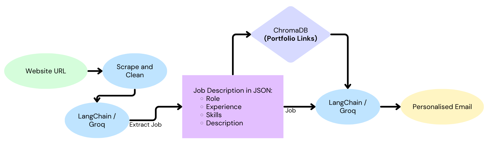

# AI-Powered Cold Email Generator for Job Seekers

This project is designed to help job seekers automatically generate personalized cold emails tailored to job postings. Built with LangChain, Groq LLM, Playwright, Streamlit, and ChromaDB, it leverages a resume-based project portfolio to intelligently match relevant experience with job listings and craft professional emails in seconds.

---

## How It Works

1. **User pastes a job listing URL** (e.g., from LinkedIn, Adobe Careers, etc.).
2. The app **scrapes and cleans the job content** using Playwright and BeautifulSoup.
3. It **extracts structured role data** (role, skills, experience, and description) using an LLM chain.
4. Based on the job details, it performs a **semantic search over your project portfolio** stored in ChromaDB.
5. It uses another LLM prompt to **generate a cold outreach email**, referencing the most relevant projects.
6. The email is rendered directly in the Streamlit app.

---

## Architecture

---

## Tech Stack

| Component         | Technology Used                   |
|------------------|------------------------------------|
| Frontend UI      | Streamlit                          |
| Backend LLM      | LangChain + Groq (LLaMA3-70B)       |
| Scraping Engine  | Playwright (headless Chromium)     |
| HTML Parser      | BeautifulSoup                      |
| Vector DB        | ChromaDB (Persistent mode)         |
| Project Store    | `my_portfolio.csv`                 |
| Email Generator  | PromptTemplate + LangChain Chains  |

---

## Getting Started

### 1. Clone the repository
git clone https://github.com/your-username/cold-email-generator.git
cd cold-email-generator

### 2. Install dependencies

pip install -r requirements.txt
playwright install

### 3. Set up environment variables
Create a .env file in the root directory:

GROQ_API_KEY=your_groq_api_key_here

### 4. Start the app
streamlit run main.py

Project Portfolio Format
Your project data should be stored in app/resource/my_portfolio.csv with the following format:

Project,Techstack,Description,Link
"Cloud-Based ETL Pipeline","AWS, Apache Airflow, EC2, Glue, Redshift","Built a cloud-based ETL pipeline using Apache Airflow to process weather data and load it into Redshift for analytics.","https://jemil-portfolio.vercel.app/"
"Food Delivery Analysis","Python, Pandas, Seaborn","Performed EDA on delivery data to uncover insights about delivery times and patterns.","https://github.com/Jem1D/Food_delivery_analysis"
...

Projects with missing or placeholder links ("#") will be excluded from the generated email.

Features

Extracts real-time job data from live career pages

Uses your resume projects to generate relevant emails

Powered by Groq’s blazing-fast LLM and LangChain

Filtered to exclude generic project links

Fully open-source and customizable

📬 Contact
📧 dhariajemil@gmail.com
🌐 [Portfolio](https://jemil-portfolio.vercel.app/)
🔗 [LinkedIn](https://www.linkedin.com/in/jemil-dharia-731b58200/)

🪄 Future Enhancements

  Resume parser and keyword highlighter
  
  Export email to PDF
  
  Multiple email tone options
  
  Cover letter generator mode
